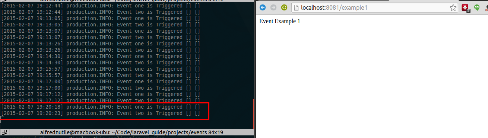
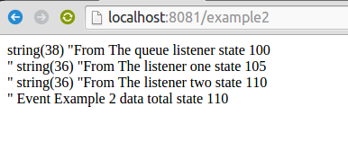

# Events

## Getting Started

See Events folder

Start the example

~~~
php artisan serve --port=8081
~~~

Then visit 

~~~
http://localhost:8081/example1
~~~

So if you look in

~~~
app/routes.php
~~~

You see route example1 will fire and event and there are two listeners

## Do they run async or sync

If you hit that [route](http://localhost:8081/example1) you see the sleep taking effect so it is syncronous 

See in the image below an example. I reload the page and the results are staggered by the sleep amount in the route. 

On the left I have 
  
~~~
php artisan tail
~~~

Here is the route

~~~
Event::listen('example1', function()
{
	sleep(5);
	Log::info("Event one is Triggered");
});

Event::listen('example1', function()
{
	sleep(5);
	Log::info("Event two is Triggered");
});

Route::get('/example1', function()
{
	Event::fire('example1');
	return "Event Example 1";
});
~~~

So if you did not want to hold up the process you would place these into a queue.

## Passing data to events

How can Event 1 alter Event 2 and Event 3 

See route would be [/example2](http://localhost:8081/example2)

Also there is a registered event listener seen in the route file
that 

~~~
$subscriber = new \Acme\ExampleEventHandler;
Event::subscribe($subscriber);
~~~

Which shows how that made it hard to pass a state

~~~
$subscriber = new \Acme\ExampleEventHandler;

Event::subscribe($subscriber);

Event::listen('example2', function($state)
{
	$state->total = $state->total + 5;
	var_dump(sprintf("From The listener one state %s  ", $state->total));

	Log::info(sprintf("Event two listener 1 is Triggered total %s", $state->total));
});

Event::listen('example2', function($state)
{
	$state->total = $state->total + 5;
	var_dump(sprintf("From The listener two state %s  ", $state->total));

	Log::info(sprintf("Event two listener 2 is Triggered total %s", $state->total));
});

Route::get('/example2', function()
{
	$state = new stdClass();
	$state->total = 0;
	Event::fire('example2', array($state));

	return sprintf("Event Example 2 data total state %s", $state->total);
});
~~~

This one you just see in the browser 

