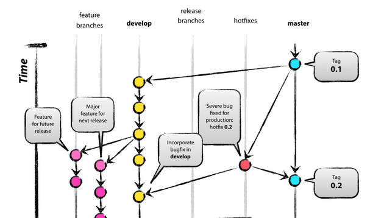

# Git

If you truly new to Git then great. The guide on Michael Hartl site [1.4 Version Control with Git](https://www.railstutorial.org/book/beginning#sec-version_control) is a good start.

Going the Homestead route and setting up your ssh keys as noted [Set Your SSH Key](http://laravel.com/docs/master/homestead) will make it easy to get going on git with your github account.

## Github Account

Get one! It is fun and key to showing your work to others and sharing.

This tutorial will cover git as we use it as well so please get it installed.

## Mac

Xcode and then from there download the related developer tools in preferences.

## Workflows

I can not say enough about this [workflow](http://nvie.com/posts/a-successful-git-branching-model/) 

It will be something you can deal with later after you get the basics. But once you build out the habits makes life a ton easier. 

