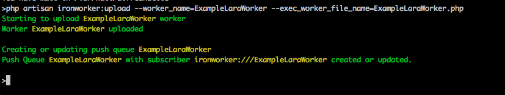
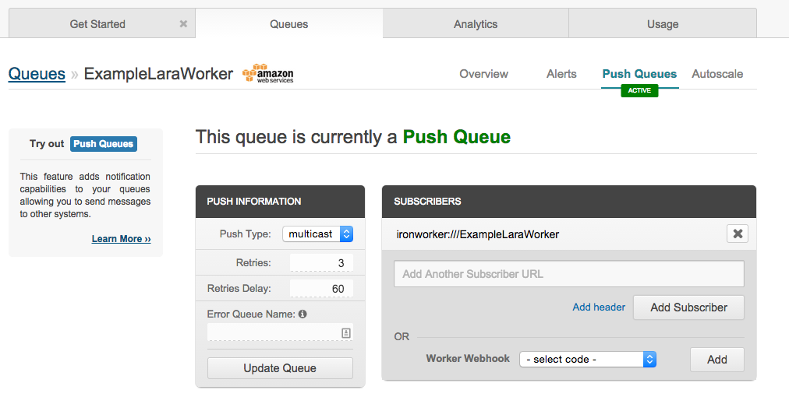
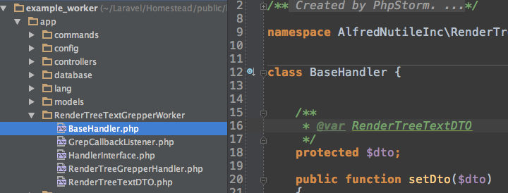
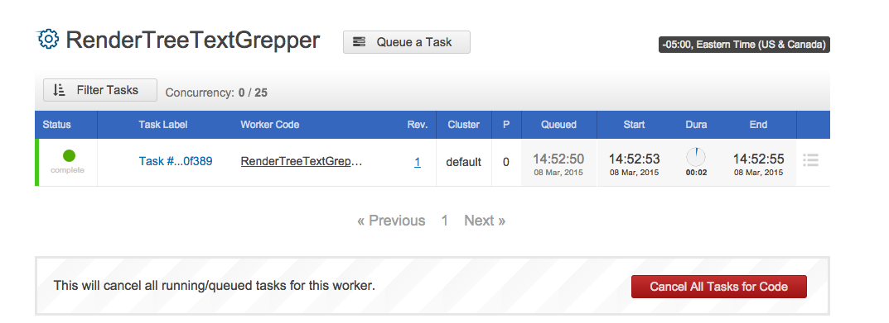

# Laravel Iron.io Workers

## Step 1 Install

Install 4.2 work. (5 might be ready soon)

~~~
composer create-project laravel/laravel=4.2 example_worker --prefer-dist
~~~

Set your minimum stability in your composer.json

~~~
	},
	"config": {
		"preferred-install": "dist"
	},
	"minimum-stability": "dev"
}

~~~

Then pull in the library

~~~
composer require iron-io/laraworker
~~~

And add this one patch for PHP 5.6 **TODO**

https://github.com/iron-io/laraworker/issues/5

and

https://github.com/iron-io/iron_core_php/blob/master/src/IronCore.php#L269

And of course as the readme.md notes for Laraworker

~~~
php vendor/iron-io/laraworker/LaraWorker.php -i true
~~~

As the developer notes this makes a new folder and file 

~~~
/worker/libs/worker_boot.php
and
/worker/ExampleLaraWorker.php
~~~

## Step 2 Configure

We will use the .env to do configuration not the way noted in the laraworker docs so lets install that. Just use [this post](https://alfrednutile.info/posts/113) to set that up.

So after you are done your 

> Set Iron.io credentials in app/config/queue.php and set default to iron --> 'default' => 'iron',

So yours will look like

~~~
# app/config/queue.php
	'default' => getenv('QUEUE_DRIVER'),

	'connections' => array(

		'iron' => array(
			'driver'  => 'iron',
			'host'    => 'mq-aws-us-east-1.iron.io',
			'token'   => getenv('IRON_TOKEN'),
			'project' => getenv('IRON_PROJECT_ID'),
			'queue'   => 'your-queue-name',
			'encrypt' => true,
		),

	),
~~~	

Then make your project on Iron and get the Token and Project ID

## Step 3 See if Example Worker works

Lets see if the Example works before we move forward.

~~~
php artisan ironworker:upload --worker_name=ExampleLaraWorker --exec_worker_file_name=ExampleLaraWorker.php
~~~

If it worked you will see 

This will upload a worker related queue

## Step 4 Make our own worker!

The goal of this worker

  * It will get a JSON object of the info needed to do a job
  * It will do the job by getting the json file from the S3 file system where it lives (it could live in a db or other location)
  * Using the JSON object's callback it will send back the results to the caller
  
That is it.

This example will be used in real life to later on parse say 100 urls for already created json render tree objects of the urls data including images and text. This job only cares about the text. Cause the job is fairly easy I will be sending to each worker 5 urls to process. 

### Copy the worker in /workers to the new Worker name 

Due to bad naming abilities I am calling this `RenderTreeTextGrepper.php`

So now my worker folder has 

~~~
RenderTreeTextGrepper.php
~~~

But I do not want that class to have all my code so I will start to build out a namespace for all of this and the 3 classed I want to manage ALL of this work.

### Class 1 @fire

So the worker will fire the class I have to handle all of this.

~~~
	"autoload": {
		"classmap": [
			"app/commands",
			"app/controllers",
			"app/models",
			"app/database/migrations",
			"app/database/seeds",
			"app/tests/TestCase.php"
		],
	  "psr-4": {
		"AlfredNutileInc\\RenderTreeTextGrepperWorker\\": "app/"
	  }
	},
~~~

~~~
composer dump
~~~

Then in `app/RenderTreeTextGrepperWorker` folder I have 

Then I register the event listener with the app/config/app.php

~~~
#app/config/app.php
'AlfredNutileInc\RenderTreeTextGrepperWorker\GrepCallbackListener'
~~~

And that is it.

What is it?

So we are going to upload and run this and here is what will happen. NO!

First lets make a test so we can see locally if all the logic is there.

### Local Test

Just a quick test to see if the handler will handle things and pass results

~~~
<?php

class RenderTreeTextTest extends \TestCase {

    /**
     * @test
     */
    public function should_populate_results()
    {
        $handle = new \AlfredNutileInc\RenderTreeTextGrepperWorker\RenderTreeGrepperHandler();
        $payload = new \AlfredNutileInc\RenderTreeTextGrepperWorker\RenderTreeTextDTO(
            'foo-bar',
            ['foo', 'bar', 'baz'],
            ['text1', 'text2'],
            [
                'caller'     => 'http://someposturl.dev/rendertree_results',
                'params'     => ['foo', 'bar']
            ],
            false,
            false
        );
        $results = $handle->handle($payload);

        var_dump($results);
        $this->assertNotNull($results);
    }
}
~~~

Running this

~~~
phpunit --filter=should_populate_results
~~~

Produces this

~~~
 class AlfredNutileInc\RenderTreeTextGrepperWorker\RenderTreeTextDTO#334 (6) {
    public $uuid =>
    string(7) "foo-bar"
    public $urls =>
    array(3) {
      [0] =>
      string(3) "foo"
      [1] =>
      string(3) "bar"
      [2] =>
      string(3) "baz"
    }
    public $text =>
    array(2) {
      [0] =>
      string(5) "text1"
      [1] =>
      string(5) "text2"
    }
    public $callback =>
    array(2) {
      'caller' =>
      string(41) "http://someposturl.dev/rendertree_results"
      'params' =>
      array(2) {
        ...
      }
    }
    public $results =>
    array(1) {
      [0] =>
      string(21) "Listener is listening"
    }
    public $status =>
    bool(false)
  }
}
~~~

Of course I need to go into more testing for the two classes to see how they react to different data going in but just to see that there are not obvious issues before I upload the worker.

### Upload the worker we just made

~~~
php artisan ironworker:upload --worker_name=RenderTreeTextGrepper --exec_worker_file_name=RenderTreeTextGrepper.php
~~~

And then we see on Iron.io

Then we run it

~~~
php artisan ironworker:run --queue_name=RenderTreeTextGrepper
~~~

Before that though I updated `app/commands/RunWorker.php:20` to make a better payload

~~~
    public function fire()
    {
        $queue_name = $this->option('queue_name');
        $payload = "This is Hello World payload :)";
        
        if($queue_name == 'RenderTreeTextGrepper')
        {
            $payload = new \AlfredNutileInc\RenderTreeTextGrepperWorker\RenderTreeTextDTO(
                'foo-bar',
                ['foo', 'bar', 'baz'],
                ['text1', 'text2'],
                [
                    'caller'     => 'http://someposturl.dev/rendertree_results',
                    'params'     => ['foo', 'bar']
                ],
                false,
                false
            );
        }
~~~

We then see the Task

And the example log output

## Guzzle and the Callback

How to format the callback?

Let's require guzzle 

~~~
composer require guzzlehttp/guzzle
~~~

At this point we have a working example. The queue takes the json and the worker processes it!

That simple.

