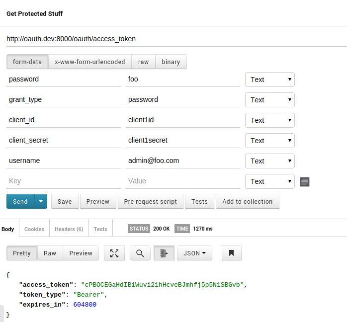
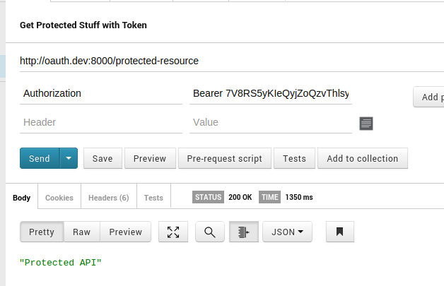
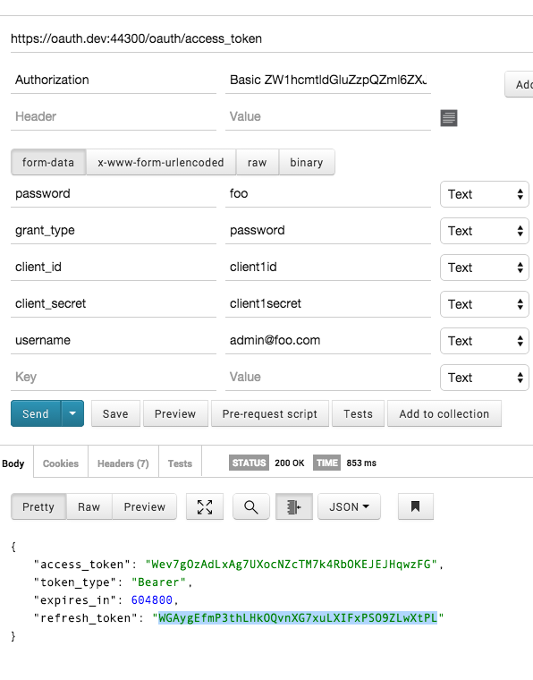

# Oauth and Angular

Starting with [this library](https://github.com/lucadegasperi/oauth2-server-laravel/wiki/Installation) which will use the PHPLeague Oauth2 server.

## Starting off with Email Passowrd

[directions on password grant_type](https://github.com/lucadegasperi/oauth2-server-laravel/wiki/Implementing-an-Authorization-Server-with-the-Password-Grant)

## Setup

~~~
cp .env.example .env
touch app/database/local.sqlite
composer install
php artisan migrate
php artisan db:seed --class=ClientsTableSeeder
~~~

Using [Postman](http://www.getpostman.com/docs)

I can then test the endpoint 

~~~
#route.php
Route::post('oauth/access_token', function() {
	return Response::json(Authorizer::issueAccessToken());
});
~~~

Postman looks like this to get the token using POST

Then using that token that came from the seed and a fake username and password (we have not seeded that yet)

We get a token access Bearer that token we can use for future requests.

Now we use that in a request to the protected resource in URL

~~~
https://oauth.dev:44300/protected-resource?access_token=to7QVRpxs6GaKRqUhgDth8UTfhEifv6KrYWao7HR
~~~

Or with Token in header

BUT reading this [http://jeremymarc.github.io/2014/08/14/oauth2-with-angular-the-right-way/](http://jeremymarc.github.io/2014/08/14/oauth2-with-angular-the-right-way/) passing the client secret it not safe

Also sending not in query string but header

~~~
You can either add the access token as a query param or http header. I would recommend using http header because it has 2 main advantages:

there is no risk that your access token will be stored in a log file on the server.
it's better to have a "clean" url
~~~

And with a refresh token

## Angular

BUT reading this [http://jeremymarc.github.io/2014/08/14/oauth2-with-angular-the-right-way/](http://jeremymarc.github.io/2014/08/14/oauth2-with-angular-the-right-way/) passing the client secret it not safe

Also sending not in query string but header

~~~
You can either add the access token as a query param or http header. I would recommend using http header because it has 2 main advantages:

there is no risk that your access token will be stored in a log file on the server.
it's better to have a "clean" url
~~~

## Config

~~~
#app/config/packages/lucadegasperi/oauth2-server-laravel/oauth2.php
<?php

use Illuminate\Support\Facades\Auth;

return [

    'database' => 'default',
    
    'grant_types' => [
        'password' => [
            'class'            => 'League\OAuth2\Server\Grant\PasswordGrant',
            'access_token_ttl' => 604800,
    
            // the code to run in order to verify the user's identity
            'callback'         => function($username, $password){
                $credentials = [
                    'email'    => $username,
                    'password' => $password,
                ];

                dd($credentials);
    
                if (Auth::once($credentials)) {
                        return Auth::user()->id;
                    } else {
                        return false;
                    }
            }
        ],
    ],

    'token_type' => 'League\OAuth2\Server\TokenType\Bearer',

    'state_param' => false,

    'scope_param' => false,

    'scope_delimiter' => ',',
    
    'default_scope' => null,

    'access_token_ttl' => 3600,

    'limit_clients_to_grants' => false,
    
    'limit_clients_to_scopes' => false,

    'limit_scopes_to_
    grants' => false,

    'http_headers_only' => false,
];
~~~

## Angular

So now Angular has to do several things

### 1) Login page with client_id and secret set

### 2) Store the results when successful 

### 3) Catch when token expires and reset token or ask for login

## Laravel Admi UI

Give out tokens maybe just command line?

## Scopes

